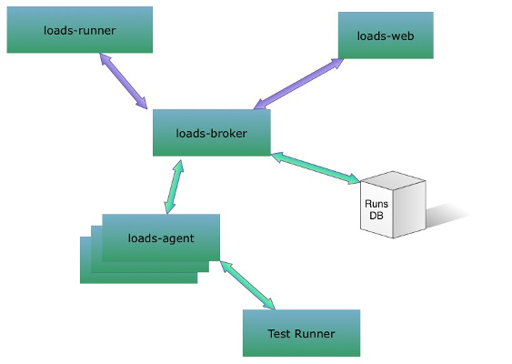
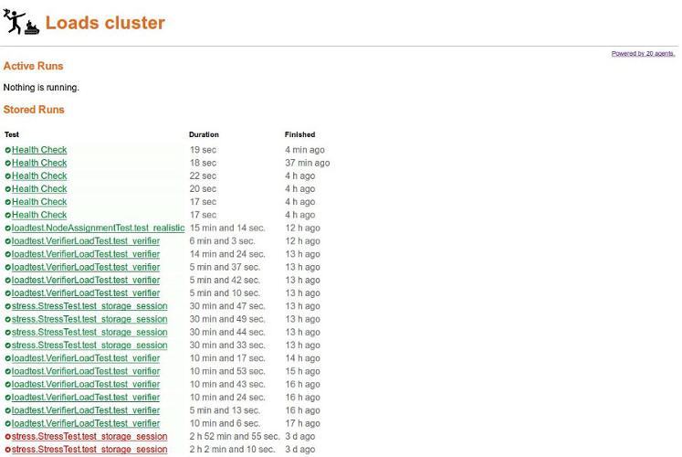
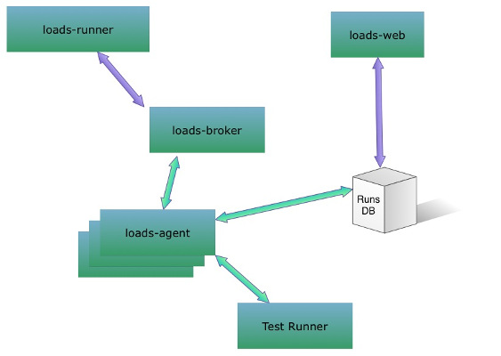

Loads — DjangoCon EU
====================

----

.. class:: center

    **Conterit Omnia Tua Application**

    Rémy Hubscher - natim@mozilla.com - @natim

----

What is Loads for?
==================

Loads is there to answer this kind of questions:

- Is your architecture ready to handle your user loads?
- Does it break under pressure?
- How far can you push your server architecture?

It let you run a load test:

- From a computer
- From a local cluster
- From a cloud cluster

And it is always the same simple command::

    $ loads-runner --ssh user@loads-master loadtests.TestWebSite.test_es

----

How to write a test for loads
=============================

You can just write a Python unittest:

.. code-block:: python

    from loads.case import TestCase
    
    class TestWebSite(TestCase):
    
        def test_es(self):
            res = self.session.get('http://localhost:9200')
            self.assertEqual(res.status_code, 200)

        def test_island(self):
            self.assertTrue('island' in self.app.get('/'))

        def test_something(self):
            self.assertTrue('island' in self.app.get('/'))
            self.incr_counter('island-was-there')

- `self.session` is a wrapper around `requests.Session` that will handle the load to a specific endpoint.
- `self.app` is a similar wrapper around `WebTest` so that you can run the same tests on different endpoints or even use a functional test as loadtest.
- You can load test websockets

----

Deploy a cluster
================

- You need to start a loads-broker on you cluster master.
- You need to start a loads-agent per node.

We use `circus` to monitor `loads-broker` and `loads-agent` processes.

You can use loads-runner with command line arguments as well as using a configuration file.

----

Monitor your cluster
====================

There is a web dashboard that can show you the status of your cluster in real-time:

----

Results
=======

.. code-block:: console

    $ loads-runner loadtests.TestWebSite.test_something \
            --include-file loadstests.py \
            -u 200 --server-url http://2014.djangocon.eu
    [==============================================================] 100%
    Duration: 2.87 seconds
    Hits: 200
    Started: 2014-05-09 16:13:38.219595
    Approximate Average RPS: 69
    Average request time: 0.58s
    Opened web sockets: 0
    Bytes received via web sockets : 0
    
    Success: 200
    Errors: 0
    Failures: 0
    
    Slowest URL: http://178.32.28.121:80/ Average Request Time: 0.5801773
    Stats by URLs:
    - http://178.32.28.121:80/
            Average request time: 0.5801773 Hits success rate: 1.0
    Custom metrics:
    - island-was-there : 200

----

The future of loads
===================

- We are improving the architecture to reduce the bottleneck between
  `loads-broker` and `loads-agent` with a centralized database in the
  middle.
- We are building a ``loads-runner`` interface for other languages (go, node, etc.)
